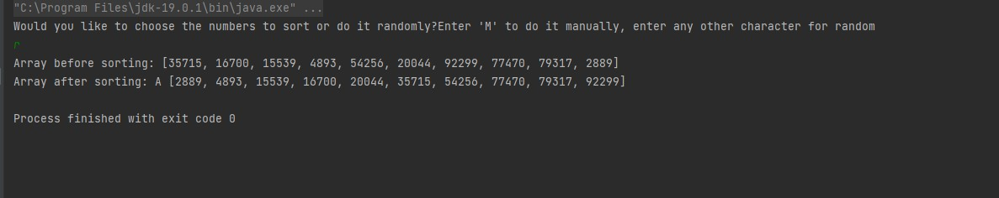
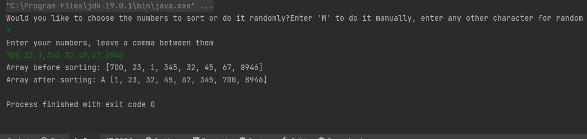

# Bubble Sorter Project
In this project, a Bubble Sorter was coded. Given the input of an array of
numbers, the code would sort it in order of lowest to highest and return the sorted
array.

## Input

The code asks the user whether they would like to choose the numbers in the array,
or let the program select 10 random numbers.  

To choose the numbers, the user must enter a "M" or "m" character. Otherwise they can
input any other character to start the random process.

```java
public class Input {


    public static String bubbleInput(){
        String bubbleInput;
            System.out.println("Would you like to choose the numbers to sort or do it randomly?"+
                    "Enter 'M' to do it manually, enter any other character for random");

            Scanner input = new Scanner(System.in);
            bubbleInput = input.nextLine();
            if (bubbleInput.toLowerCase().equals("m")) {
                bubbleInput = "Manual";
            } else {
                bubbleInput = "Random";
            }
            return bubbleInput;
        }
    }
```

## Bubble Generator

If the user chooses the manual route, they then proceed to enter their numbers
separating them by a single comma each time. Any other input causes an error.
Their input is saved as string and this is then converted to an integer array.
If they did not select manual, this section of the code uses the random function
to generate an integer array of 10 random numbers in no particular order.

```java
public class BubbleGenerator {

    public static int[] bubbleGenerator(String bubbleInput){
        int[]bubbleGenerator;

        if (bubbleInput.equals("Manual")) {
            System.out.println("Enter your numbers, leave a comma between them");
            Scanner enterBubbles = new Scanner(System.in);
            String strBubbles = enterBubbles.nextLine();
            bubbleGenerator = stringConvert(strBubbles);
        }
        else {
            Random rand = new Random();
            int[] numbers = new int[10];

            for(int i = 0; i < numbers.length; i++){
                numbers[i] = rand.nextInt(100000);
            }
            bubbleGenerator = numbers;
        }
        return bubbleGenerator;
    }

    private static int[] stringConvert (String strBubbles){
        String[] strArrBubbles = strBubbles.split("[,]", 0);
        int[] intArrBubbles = new int[strArrBubbles.length];
        for(int i = 0; i < strArrBubbles.length; i++){
            intArrBubbles[i] = Integer.parseInt(strArrBubbles[i]);
        }
        return intArrBubbles;
    }
}
```
## Bubble Sorter

This is the part of the code that carries out the bubble sorting. Starting from the first
number it compares it to the number to it's right and swaps them if the one on the left is
bigger. This process is repeated the same amount of times as there are numbers in the array
and the end result is a sorted array.
```java
public class BubbleSort {

    public static void bubbleSort(int[] bubbleGenerator) {
        int a[] = bubbleGenerator;

        System.out.println("Array before sorting: " + Arrays.toString(a));
        int n = a.length;
        for(int i = 0; i < n-1; i++){
            for(int j = 0; j < n-1; j++){
                if (a[j] > a[j + 1]){
                    int temp = a[j];
                    a[j] = a[j+1];
                    a[j+1] = temp;
                }
            }
        }
        System.out.println("Bubbles after sorting: " + Arrays.toString(a));
    }
}
```

## Bubbles Starter and Main

A starter is used to initialise the different classes of code and to keep the main
tidy.
```java
public class BubbleStarter {
    public static void bubbleStarter(){
        BubbleSort.bubbleSort(BubbleGenerator.bubbleGenerator(Input.bubbleInput()));
    }
}
public class Main {
    public static void main(String[] args) {
        BubbleStarter.bubbleStarter();
    }
}

```
The output reader looks like this when a random selection of integers is chosen



The output reader looks like this when the process is completed manually




## Testing

For testing purposes, the BubbleSort code was refactored to return a string.
Single tests were carried out using JUnit, the second one included a negative number
and this did not disrupt the code.

```java
public static String bubbleSort(int[] bubbleGenerator) {
        int a[] = bubbleGenerator;

//        System.out.println("Array before sorting: " + Arrays.toString(a));
        int n = a.length;
        for(int i = 0; i < n-1; i++){
            for(int j = 0; j < n-1; j++){
                if (a[j] > a[j + 1]){
                    int temp = a[j];
                    a[j] = a[j+1];
                    a[j+1] = temp;
                }
            }
        }
        return Arrays.toString(a);
    }
  }
```

```java
class BubbleSortTest {
    @Test
    @DisplayName("Given an int array of [4, 2, 3, 1], BubbleSort will return [1, 2, 3, 4]")
    public void givenAnInoutArrayOf4_2_3_1_BubbleSort_Returns1_2_3_4() {
        int[] bubbleGenerator = {4, 2, 3, 1};
        String expectedResult = "[1, 2, 3, 4]";
        String result = BubbleSort.bubbleSort(bubbleGenerator);
        assertEquals(expectedResult, result);
    } // Test Passed

    @Test
    @DisplayName("Given an int array of [4560, -10, 234, 2345], BubbleSort will return [-10, 234, 2345, 4560]")
    public void givenAnInputArrayIncludingNegative_BubbleSort_Returns_LowestToHighest() {
        int[] bubbleGenerator = {4560, -10, 234, 2345};
        String expectedResult = "[-10, 234, 2345, 4560]";
        String result = BubbleSort.bubbleSort(bubbleGenerator);
        assertEquals(expectedResult, result);
    } // Test Passed

}
```
## Retrospective

Although the code ran sufficiently, it needs to be more user friendly. The code ran into an
exception if the input was not correct.

Also, whilst the principle of single responsibility was incorporated into the different
classes. The code failed to use private methods to reflect the open/closed principle.

## Sorted Array Merger

The second part of the project was to create code that would merge two already sorted arrays
and output a single sorted array which combined both arrays.

The code uses the sorted arrays as the two parameters and creates an empty third integer array which
is equal in length to the combined lengths of the two parameters.

Three integers: i for sortedArr1; j for sortedArr2; and k for mergedArr (the final array);
are created and set to 0.

A while loop with the length of each parameter array set as the number of iterations each respective
i and j can go through is created.

For each iteration, the first integer of each parameter is compared. The lower one
is added to the final array. If the lower one was in arr1, i increases by one (it moves
onto the next number in the array) and vice versa. Also, k increases by one so now the next integer will be
added to the next spot in the final array.

These iterations continue until all numbers are added to k in the correct order.


```java
public class SortedArraysMerger {

    public static int[] merger(int[] sortedArr1, int[] sortedArr2) {


        int length1 = sortedArr1.length;
        int length2 = sortedArr2.length;

        int[] mergedArr = new int[length1 + length2];

        int i = 0;
        int j = 0;
        int k = 0;

        while (i < length1 && j < length2) {
            if (sortedArr1[i] < sortedArr2[j]) {
                mergedArr[k] = sortedArr1[i];
                k++;
                i++;
            } else {
                mergedArr[k] = sortedArr2[j];
                k++;
                j++;
            }
        }
        while (i < length1) {
            mergedArr[k] = sortedArr1[i];
            k++;
            i++;
        }
        while (j < length2) {
            mergedArr[k] = sortedArr2[j];
            k++;
            j++;
        }
        return mergedArr;
    }

    public static void printArray(){

        int[] sortedArr1 = { 1, 5, 8, 9};
        int[] sortedArr2 = { 2, 3, 4, 6, 10};

        int[] mergedArr = merger(sortedArr1, sortedArr2);

        System.out.println(Arrays.toString(mergedArr));

    }


}

public class Main {
    public static void main(String[] args) {
        SortedArraysMerger.printArray();
    }
}
```
## Testing Sorted Array merger

For testing purposes, the printArray method was refactored to return a String.
Simple tests were carried out and they both passed confirming that the code worked.

```java
public static String printArray(int[] sortedArr1, int[] sortedArr2){

        int[] mergedArr = merger(sortedArr1, sortedArr2);

        return Arrays.toString(mergedArr);

}

@Test
   @DisplayName("Given two sorted arrays, the SortedArraysMerger will output a combined sorted array")
   public void givenTwoSortedArrays_SortedArraysMerger_WillOutputCombinedSortedArray(){
       int[] sortedArr1 = {1, 4, 6, 19, 21};
       int[] sortedArr2 = {2, 5, 7, 20, 22};
       String expectedResult = "[1, 2, 4, 5, 6, 7, 19, 20, 21, 22]";
       String result = SortedArraysMerger.printArray(sortedArr1, sortedArr2);
       assertEquals(expectedResult, result);
       // Test Passed
   }

   @Test
       @DisplayName("Given two very different sorted arrays, the SortedArraysMerger will output a combined sorted array")
       public void givenTwoVeryDifferentSortedArrays_SortedArraysMerger_WillOutputCombinedSortedArray(){
           int[] sortedArr1 = {1, 400, 800, 2300, 34000};
           int[] sortedArr2 = {401, 405, 607, 720, 722};
           String expectedResult = "[1, 400, 401, 405, 607, 720, 722, 800, 2300, 34000]";
           String result = SortedArraysMerger.printArray(sortedArr1, sortedArr2);
           assertEquals(expectedResult, result);
           // Test Passed
       }

## Retrospective

No attempt was really made to follow the solid principles however, the code ran well
and was relatively efficient.
